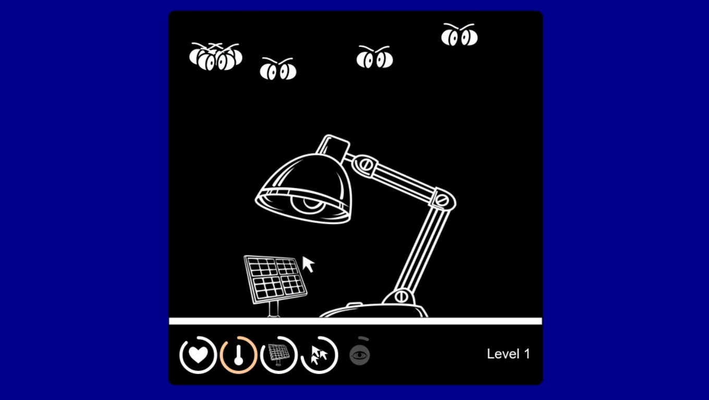
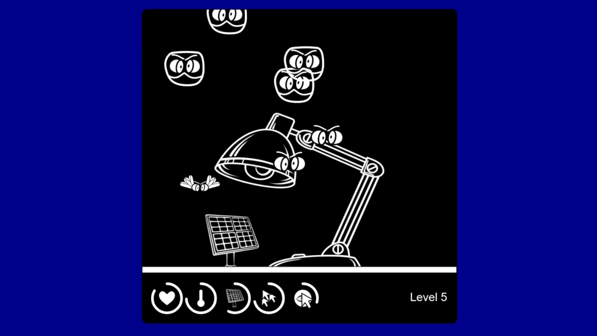
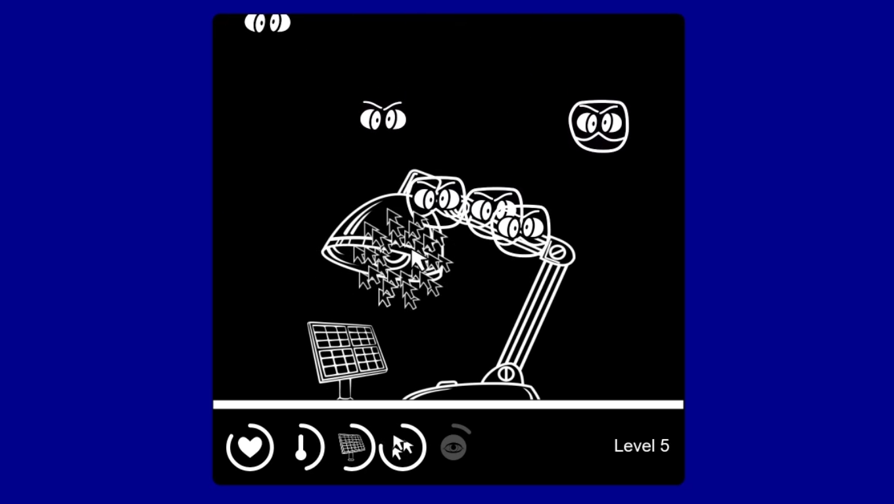

## Lamp Press Game

  
  
  

Video Demo Here --> [google drive](https://drive.google.com/file/d/17bLiGP7M3MBm2wiWaq_QWdgwQFbpnleI/view?usp=sharing)

Protect Switch, a lone lamp, from a constant barrage of enemies coming from above. Your goal is to survive without wasting health and charge your friend, Battery, to full capacity. But don't worry, you're not alone - you've got two special perks to help you out.

First, there's Multi Arrow: with a single click, you'll unleash a swarm of 10+ cursors to push back enemies and give you some breathing room. And when things get really tough, activate Dead Eye - just like in the Wild West, time slows down, and a yellow glow takes over the screen. Take aim, and unleash a hail of bullets to clear the screen of enemies. 

GET READY!

---

Written with **JavaScript + HTML + CSS**.

Libraries used:
- [**p5.js**](https://p5js.org/)
